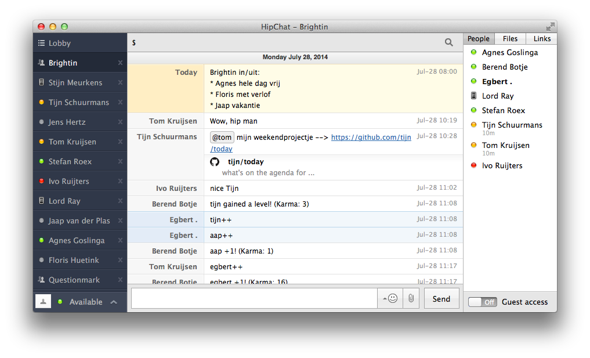

# Today

Post on HipChat what's on a Google Calendar for today.



## Why?

This project grew out of the need to be informed about how many people one can expect to see at the office.

At our office, every day is different. You never know who you can expect to see there. Some colleagues visit clients, others are doing part time academic work, someone could have a day off or maybe working from home... you get the gist.

Instread of having to look this up in our company calendar, we now have this information posted in our company chatroom every morning at 7 AM.


## Setup

### Get the code

First, fork or clone this repository and put it up somewhere (Heroku, your own server, whatever you want).

### Google Calendar API setup

* [Enable the Calendar API](https://console.developers.google.com/flows/enableapi?apiid=calendar) for your Google project.
* get yourself a [Google Developer service account](https://developers.google.com/identity/protocols/
OAuth2ServiceAccount). Other OAuth2 authentication methods (client, installed app) won't do.
* Temporarily store the service account's P12 certificate, certificate password and e-mail address somewhere.

Getting this up and running can be quite tricky... Google tends to change these procedures a lot lately. When in doubt, search for additional instructions.

### Calendar ID and Sharing

* Look up the Google Calendar's ID in the Calendar Settings page (somewhere near the XML, ICS, and HTML feed buttons)
* Share the Google Calendar(s) with the service account's e-mail address you  (otherwise, you'll only get an empty event list)

### Set up `ENV` variables

#### `CALENDAR_ID`

Google Calendar ID. For multiple calendars, use `,` as separator.

#### `CLIENT_P12_KEY`

Base64 encoded P12 key. Ruby example:

~~~ruby
require 'base64'
raw_data = File.open('<P12_KEY_FILE>', 'rb') { |io| io.read }
Base64.encode64(raw_data)
~~~

#### `CLIENT_P12_PASSWORD`

The certificate password as provided by Google.

#### `CLIENT_ISSUER`

The service account's e-mail address as provided by Google.

#### `HIPCHAT_TOKEN`

Access token for posting to HipChat.

#### `HIPCHAT_ROOM`

HipChat room to post today's event summary in.

#### `TZ` (optional)

Time zone where your HipChat room is in. Leave this blank to depend on system time zone information.


## Usage

Call the following Rake task to send a message to HipChat:

```sh
$ rake hipchat
```

This rake task can be scheduled as a cron job, e.g. via Heroku scheduler or via `crontab` directly, depending on where you host the application.


## Support, questions, ideas, contributing

Please open an issue on GitHub!

